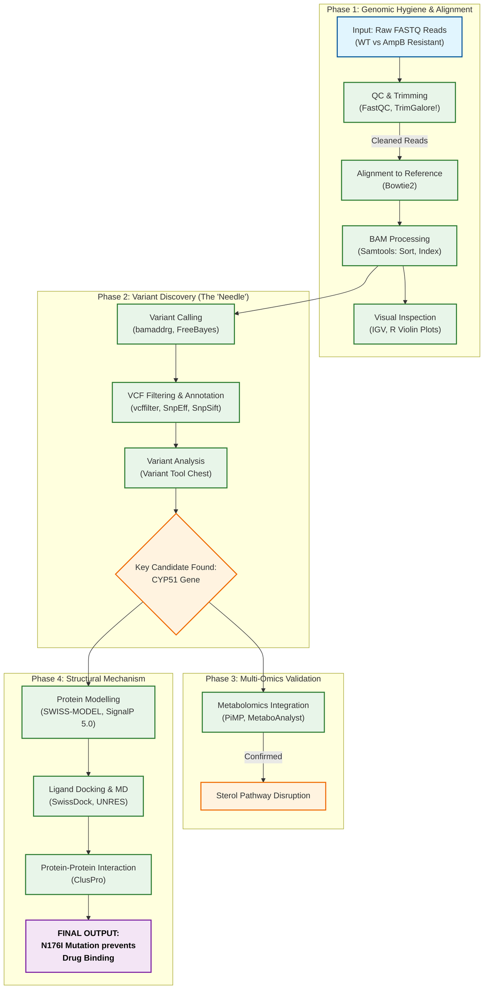

```mermaid
flowchart TD
    %% Define Styles
    classDef input fill:#e1f5fe,stroke:#01579b,stroke-width:2px;
    classDef process fill:#e8f5e9,stroke:#2e7d32,stroke-width:2px;
    classDef finding fill:#fff3e0,stroke:#ef6c00,stroke-width:2px;
    classDef output fill:#f3e5f5,stroke:#7b1fa2,stroke-width:2px,color:black,font-weight:bold;

    subgraph "Phase 1: Genomic Hygiene & Alignment"
        A["Input: Raw FASTQ Reads<br>(WT vs AmpB Resistant)"]:::input --> B["QC & Trimming<br>(FastQC, TrimGalore!)"]:::process
        B -->|Cleaned Reads| C["Alignment to Reference<br>(Bowtie2)"]:::process
        C --> D["BAM Processing<br>(Samtools: Sort, Index)"]:::process
        D --> E["Visual Inspection<br>(IGV, R Violin Plots)"]:::process
    end

    subgraph "Phase 2: Variant Discovery (The 'Needle')"
        D --> F["Variant Calling<br>(bamaddrg, FreeBayes)"]:::process
        F --> G["VCF Filtering & Annotation<br>(vcffilter, SnpEff, SnpSift)"]:::process
        G --> H["Variant Analysis<br>(Variant Tool Chest)"]:::process
        H --> I{"Key Candidate Found:<br>CYP51 Gene"}:::finding
    end

    subgraph "Phase 3: Multi-Omics Validation"
        I --> J["Metabolomics Integration<br>(PiMP, MetaboAnalyst)"]:::process
        J -->|Confirmed| K["Sterol Pathway Disruption"]:::finding
    end

    subgraph "Phase 4: Structural Mechanism"
        I --> L["Protein Modelling<br>(SWISS-MODEL, SignalP 5.0)"]:::process
        L --> M["Ligand Docking & MD<br>(SwissDock, UNRES)"]:::process
        M --> N["Protein-Protein Interaction<br>(ClusPro)"]:::process
        N --> O["FINAL OUTPUT:<br>N176I Mutation prevents<br>Drug Binding"]:::output
    end
```
